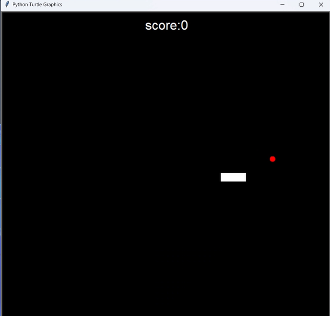
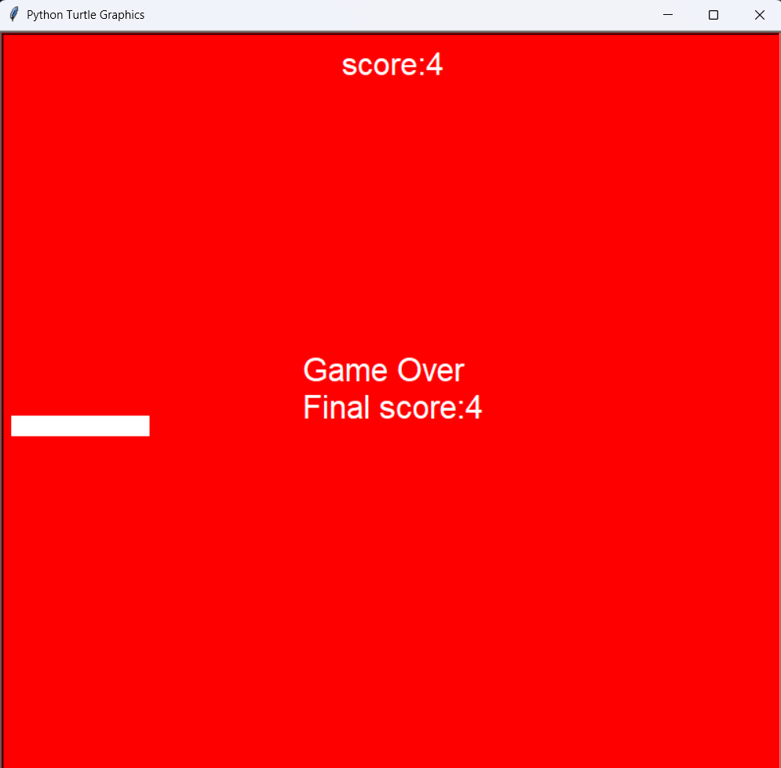

🐍 Snake Game – Python

📌 About the Project

This project is a classic Snake Game developed using Python.
The goal of the game is to control the snake, eat the food to grow longer, and avoid colliding with the walls or the snake's own body.

This project demonstrates basic game development concepts such as:

- Game loop
- Collision detection
- Score tracking
- Keyboard input handling

🎮 Game Features

- Real-time snake movement
- Food spawning system
- Score tracking system
- Game Over screen
- Simple and clean game interface

🛠 Technologies Used

- Python
- Turtle Graphics (Python Turtle)

🎯 Game Controls

Control the snake using the arrow keys:

⬆️ Up Arrow → Move Up
⬇️ Down Arrow → Move Down
⬅️ Left Arrow → Move Left
➡️ Right Arrow → Move Right

## 📷 Game Preview

### During Gameplay

### Game Over

Screenshots of the game are included in the repository.

💡 Project Purpose

This project was created to practice Python programming and basic game development concepts.
